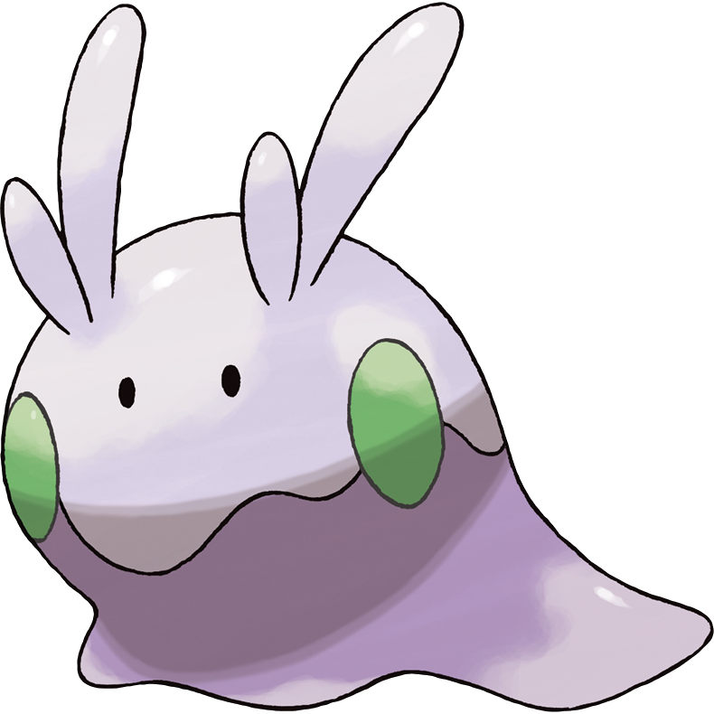

# Project Info
Github username: [carolinetang77](https://github.com/carolinetang77)  
[Github repository](https://github.com/carolinetang77/biol432)
Date: March 9, 2022

# Dragon Phylogeny
## New dragons
I added Gible, Goomy, and Appletun from the Pokemon series to the phylogeny. All photos and information were obtained from [Bulbapedia](https://bulbapedia.bulbagarden.net/wiki/Main_Page).

## Gible
  
Original Gible Art ([Source](https://bulbapedia.bulbagarden.net/wiki/Gible_(Pok%C3%A9mon)))  

## Goomy
  
Original Goomy Art ([Source](https://bulbapedia.bulbagarden.net/wiki/Goomy_(Pok%C3%A9mon)))  

## Appletun
  
Original Art ([Source](https://bulbapedia.bulbagarden.net/wiki/Appletun_(Pok%C3%A9mon)))  

## Creating the phylogeny
Load in all the libraries
```{r}
library(ape)
library(reshape2)
library(ggplot2)
library(ggtree)
library(ggimage)
```

Load in dragon data and trait weights
```{r}
dragonNexus <- read.nexus.data("A7_Tang_Caroline.nex")
weightDat <- read.csv("https://colauttilab.github.io/Data/Weights.csv")
```

Convert dragon data to weighted traits
```{r}
#separate weights and convert them to a numeric scale (1-35 where A = 10 and Z = 35)
weights <- paste(weightDat$Weight, collapse = "")
weights <- unlist(strsplit(weights, split = ""))

numericWeight <- vector(length = length(weights))
for (i in 1:length(weights)) {
  if (weights[i] %in% LETTERS) {
    numericWeight[i] <- which(LETTERS == weights[i]) + 9
  } else {
    numericWeight[i] <- as.numeric(weights[i])
  }
}

#multiply each trait by the weight
wtDragonNexus <- dragonNexus
for (i in 1:length(dragonNexus)) {
  Repweight <- dragonNexus[[i]]==1
  wtDragonNexus[[i]] <- numericWeight * Repweight
}

#convert to dataframe
wtDragonDF <- data.frame(matrix(unlist(wtDragonNexus), ncol = length(wtDragonNexus[[1]]), byrow = T))
row.names(wtDragonDF) <- names(wtDragonNexus)
```

Calculate Euclidean distances and convert to a matrix
```{r}
wtDragonDist <- dist(wtDragonDF, method = "euclidean")
wtDragonDM <- as.matrix(wtDragonDist)
```

Create the tree using neighbour joining methods
```{r}
wtDragonNJ <- nj(wtDragonDist)

#separate dragons into pokemon and non-pokemon
origin <- gsub(".*\\d+([^X]*).*", "\\1", row.names(wtDragonDF))
pokemon <- split(row.names(wtDragonDF), origin=="Pokemon")
wtDragoncol <- groupOTU(wtDragonNJ, pokemon)

#Create better labels for tips and add images
dragonLabel <- data.frame(dragon = row.names(wtDragonDF),
                          lab = gsub("(.*\\d+)([^X]*).*", "\\1-\\2", row.names(wtDragonDF)),
                          image = c(rep(NA, nrow(wtDragonDF) - 3), "A7_Tang_Caroline_Gible_Pixel.png", "A7_Tang_Caroline_Goomy_Pixel.png", "A7_Tang_Caroline_Appletun_Pixel.png"))
```

Create phylogenetic tree, added dragons are highlighted in red
```{r, warning=FALSE}
ggtree(wtDragoncol, layout = "rectangular") %<+% dragonLabel +
  geom_tree(aes(colour = group)) +
  geom_tiplab(aes(label = lab), size = 1.5) +
  geom_tiplab(aes(image = image), geom = "image", offset = 2, size = 0.1) +
  xlim(0, 70) +
  scale_colour_manual(values = c("black", "red")) +
  theme(legend.position = "none")
```


